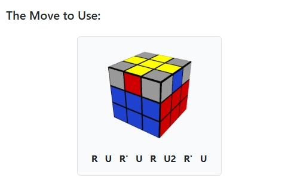

#  3x3 Rubik's Cube Website

This is a personal portfolio project, focused on the **3×3 Rubik's Cube**.The website consists of three pages that introduce the cube, teach how to solve it, and explore the world of speedcubing.

This website is **deployed using GitHub Pages** and can be accessed at: **[https://sasha-fedorov.github.io/rubiks-cube/](https://sasha-fedorov.github.io/rubiks-cube/)**

## Contents

- [User Experience (UX) & User Stories](#user-experience-ux--user-stories)
  - [User Roles](#user-roles)
  - [Features & User Stories](#features--user-stories)
    - 1. [About the Cube (Main Page)](#1-about-the-cube-main-page)
    - 2. [How to Solve It (Solving Page)](#2-how-to-solve-it-solving-page)
    - 3. [Speedcubing (Speedcubing Page)](#3-speedcubing-speedcubing-page)
  - [Design](#design)
  - [Color Scheme](#color-scheme)
  - [Typography](#typography)
  - [Imagery](#imagery)
  - [Features (Design Aspect)](#features-design-aspect)
  - [Accessibility](#accessibility)
  - [Lighthouse](#lighthouse)
- [Technologies Used](#technologies-used)
  - [Languages and Frameworks](#languages-and-frameworks)
  - [Tools & Programs](#tools--programs)
  - [Services](#services)
- [Validation](#validation)
  - [HTML Validation](#html-validation)
  - [CSS Validation](#css-validation)
- [Deployment Process](#deployment-process)
- [Testing and Bugfixing](./documentation/testing.md)
- [Credits](#credits)
- [License / Usage](#license--usage)

## User Experience (UX) & User Stories

This section outlines the core user experience principles guiding the website's design and the specific user stories that each feature aims to address. The goal is to ensure the website is intuitive, engaging, and meets the needs of its diverse audience, achieved through a focus on **minimal visual load, clear information hierarchy, and thoughtful accessibility**.

### User Roles

- **Curious Beginner:** New to the Rubik's Cube.
- **Aspiring Solver:** Wants to learn to solve.
- **Rubik's Cube Enthusiast/Fan:** Interested in advanced topics, records, and trivia.
- **Casual Browser:** Exploring out of general interest.
- **Return Visitor:** Seeking specific information or refreshing knowledge.

### Features & User Stories

#### 1. About the Cube (Main Page)

**Purpose:** Introduce the Rubik's Cube's history, popularity, and fun facts.

- **Feature: Brief Cube History & Fun Facts**
  - **User Story:** As a **Curious Beginner**, I want to **learn the basic history of the Rubik's Cube** so that I can **understand its origins and significance.**
  - **User Story:** As an **Enthusiast**, I want to **discover new and interesting facts about the Rubik's Cube** so that I can **deepen my appreciation or share them with others.**
  - **UX Considerations:**
    - **Content Design:** Concise and engaging content delivery with main fact topics highlighted in bold to allow users to quickly scan and spot areas of interest.
    - **Visuals:** A minimalist custom hero image provides a clear visual representation of the cube without visual clutter, aligning with the low visual load goal.
    - **Navigation:** Prominent calls to action and clear navigation links guide users to other pages like "How to Solve It".
    - **Overall Aesthetic:** The use of Bootstrap's default clean color scheme and reduced `h1` heading sizes contributes to a calming, educational environment, preventing information overload.

#### 2. How to Solve It (Solving Page)

**Purpose:** Provide a step-by-step guide to solving the 3x3 Rubik's Cube.

- **Feature: Step-by-Step Solving Guide with Visuals**
  - **User Story:** As an **Aspiring Solver**, I want to **follow clear, step-by-step instructions with pictures** so that I can **successfully solve the Rubik's Cube for the first time.**
  - **User Story:** As an **Aspiring Solver**, I want to **understand the purpose of each step and combination** so that I can **learn the method effectively, not just memorize.**
  - **User Story:** As a **Return Visitor**, I want to **quickly find a specific step or algorithm** so that I can **refresh my memory or practice a particular part of the solve.**
  - **UX Considerations:**
    - **Structured Layout:** Instructions are broken into manageable, sequential steps, each clearly separated by a horizontal line, making it easy for users to follow the progression.
    - **Visual Guidance:** Images illustrating cube states (sourced from the reference guide for their minimalistic and understandable nature) accompany each step, providing clear visual cues for correct cube orientation and moves.
    - **Readability of Algorithms:** Combinations are highlighted with a border and light gray background, using a `font-weight: 700` and `word-spacing: 0.5rem` to ensure they are distinct, easily readable, and quickly locatable for practice or reference.
    - **Responsive Alignment:** Blocks are center-aligned on small screens to maintain focus, shifting to left-alignment on medium/large screens to minimize eye movement between text and visuals, ensuring optimal readability across devices.
    - **Typography:** The standard Bootstrap typography, with adjusted font weights and `h1` sizes, maintains a concise and light appearance, reducing visual strain during the learning process.

#### 3. Speedcubing (Speedcubing Page)

**Purpose:** Introduce the competitive side of Rubik's Cubing, showcasing world records and legendary cubers.

- **Feature: World Record Timeline Table**
  - **User Story:** As an **Enthusiast**, I want to see the evolution of world records over time so that I can \*\*understand the progress and history of speedcubing.
  - **UX Considerations:**
    - **Data Readability:** The table is designed to be responsive without word wrap, introducing a horizontal scrollbar on smaller screens. This ensures crucial data (date, time, competitor) remains readable, as compressing columns would hinder comprehension.
    - **Visual Cues:** The current world record is subtly highlighted with a Bootstrap success background color (`.table-success`) to draw attention without being overly intrusive. Links within the table are styled black to reduce visual clutter.
    - **Information Density:** Minimalist flag emojis from OpenMoji are used for competitor regions, efficiently conveying information while saving space.
- **Feature: Cube Legend Introduction Cards**
  - **User Story:** As an **Enthusiast**, I want to learn about the key figures in speedcubing history so that I can connect faces to the records and appreciate their achievements.
  - **UX Considerations:**
    - **Visual Engagement:** These cards provide a visual extension to the table, offering a more personal introduction to key figures. While competitor pictures are more colorful, they are contextually accepted to add visual interest to this information-rich page.
    - **Responsive Layout:** Cards are responsively placed side-by-side on larger screens and stack vertically on smaller screens, maintaining a consistent image-to-content ratio and aesthetic.
- **Feature: Videos of Current World Records (Human & Robotic)**

  - **User Story:** As a **Curious Beginner or Enthusiast**, I want to watch videos of current world record solves so that I can witness the incredible speed and technique firsthand.
  - **UX Considerations:**
    - **Performance & Interaction:** The human solve video is initially hidden under a button. This reduces initial page load time and provides an interactive element, saving screen space for users who choose not to watch it immediately.
    - **Optimized Layout:** The robotic solve video utilizes a responsive layout adapted to its 9:16 (YouTube Shorts) format, positioning it optimally (right of details on large screens, below on small screens) for best viewing experience.

## Design

This section details the visual and interactive design choices implemented across the website, focusing on creating a clean, minimalist, and educational experience.

### Color Scheme

The primary inspiration for the website's color scheme was to achieve a **clean, minimalist look** that fosters a **calming educational environment** and avoids overwhelming the visitor. This was largely achieved by leveraging the default Bootstrap 5 color palette.

- **Bootstrap Defaults:** The design primarily utilizes Bootstrap's default colors, emphasizing a light and uncluttered aesthetic.
  - **Header and Footer Background:** `bg-body-tertiary: #f8f9fa` provides a subtle, light backdrop for global navigation and copyright information.
  - **Card Backgrounds (Solving Page):** Also `bg-body-tertiary: #f8f9fa`, maintaining consistency and visual lightness for instructional cards.
  - **Links in table:** Default link colors were overridden to `bs-dark: #212529` in the World Record table to reduce visual clutter and integrate seamlessly with the minimalist theme.
  - **Credits:** The copyright text in the top and/or bottop of the page employs a dark shade `body-secondary: #595C5F` (75% opacity of `bs-dark: #212529`). This choice supports readability and reinforces the calm, uncluttered educational environment by keeping the focus on the primary content.
- **Accent Colors (Bootstrap Themed):**
  - **Current World Record in Table:** Highlighted using background color `table-succes: #d1e7dd` to gently draw attention to the most recent achievement.
  - **"Watch Current WR" Button:** Styled with `btn-success: #198754` to provide a clear, actionable call-to-action without being overly vibrant.

- **Favicon:** Even the website's favicon (a Rubik's Cube) adheres to Bootstrap's primary colors:

  - Top Face: `bs-primary: #0d6efd`
  - Right Face: `bs-warning: #ffc107`
  - Left Face: `bs-danger: #dc3545`

### Typography

The website's typography is predominantly based on **Bootstrap's standard typography**, chosen for its **concise and light appearance**, which aligns with the goal of reducing visual load and enhancing readability.

- **Default Bootstrap Fonts:** Standard Bootstrap font families are used for general text, ensuring broad browser compatibility and legibility.
- **Custom Adjustments for Readability:**

  - **H1 Headings:** Reduced to `2.5rem` and `2rem` for small screens correspondingly to lessen visual strain and prevent pages from appearing too heavy.
  - **General Bold Text:** Font weight reduced from default `700` to `600` for most bolded text, contributing to the overall lighter visual load.

    

  - **Solving Page Combinations:** Specific combinations on the Solving page maintain a `font-weight: 700` but have increased `word-spacing: 0.5rem`. This ensures these critical sequences are easily discernible and highly readable as distinct combinations.

    

### Imagery

Imagery across the website is selected and optimized to support the educational purpose while maintaining a **minimalist aesthetic and low visual load**.

- **Main Page Hero Image:**

  - A custom photograph, taken by the developer, is used for the hero section. This image intentionally mirrors the Rubik's Cube orientation seen in the favicon, creating a subtle visual consistency.
  - It is responsively cropped (wider for larger resolutions) to optimize space utilization on bigger screens, ensuring it remains impactful without dominating the layout.
  - Its minimalist nature contributes to the site's overall low visual load, providing a clear visual representation of the Rubik's Cube without being distracting.

- **Solving Page Images:**

  - Images illustrating solving steps are sourced directly from the reference guide (`SolveTheCube.com`), chosen specifically for their **minimalistic and highly understandable visual representations** of cube states and orientations (before and after applying combinations).
  - Their purpose is to provide clear, step-by-step visual guidance, crucial for users learning the method.

    

- **Speedcubing Page Images:**

  - **Competitor Pictures:** These are the most vibrant images on the site, due to their source. However, they are accepted in this context as the Speedcubing page is more information-dense, and these photos enhance the personal connection to the "legends."
  - **Competitor Region Flags:** Sourced from OpenMoji, these flag emojis were chosen for their **minimalistic design**, which helps to save space in the World Record table while concisely conveying regional information.

    

#### For all external image sources, see: [Credits](#credits)

### Features (Design Aspect)

The website was designed with a **mobile-first approach**, ensuring core usability and responsiveness across all devices, from mobile to desktop. Key design decisions enhance content readability and user interaction:

- **Section Separation:** Each major section on every page is clearly **separated by a horizontal line**. This visual cue makes it clear where one topic ends and the next begins, aiding user navigation and comprehension (e.g., "Want to Learn How to Solve It" from "Fun Facts Corner" on the Main page, each step on the Solving page).
- **Centering vs. Left Alignment:**
  - On **small screens**, all content blocks are **aligned to the center** to keep the focus in the middle of the viewport, optimizing for mobile readability.
  - On **medium and large screens**, blocks are **left-aligned**. This prevents eye movement back and forth across the screen in search of visual representations or combinations, allowing users to keep their focus near the text they are reading.
- **Main Page - Fun Facts:**
  - Designed as a simple unordered list where the main topic of each fact is **highlighted with bold text**. This allows users to quickly scan and spot categories of interest, even if they are just Browse.
- **Solving Page - Instructional Highlights:**
  - Images of current/finished steps, combinations, and tips are **highlighted with a border and a light gray background**. This design decision ensures these crucial elements are easily discoverable, visually distinct, and serve as key reference points for both new learners and advanced users returning for specific content.
- **Speedcubing Page - World Record Table:**

  - The table is **responsive but disables word wrap** and introduces a **horizontal scrollbar** when content exceeds display width. This approach was chosen because compressing columns made information unreadable. The most critical information (date, time, competitor name, and region) remains visible, with less vital details like "competition" being the first to hide.
  - **Flag Emojis:** The use of flag emojis for competitor regions efficiently saves space while still providing intuitive visual information.

    

- **Speedcubing Page - Competitor Cards:**

  - These cards serve as a **visual extension of the World Record table**, introducing important names with key information and interesting facts.
  - Their design is **responsive**, arranging them side-by-side on larger screens and stacking them vertically on smaller screens, maintaining a consistent image-to-content ratio and aesthetic.

    

- **Speedcubing Page - Human Solve WR Video:**

  - The video is **hidden under a button**, reducing initial page load time and offering an interactive element. This also saves valuable screen space for users who may not wish to view the video immediately.

    

- **Speedcubing Page - Robotic Solve Video:**

  - This video utilizes a **responsive layout based on its 9:16 (YouTube Shorts) format**, optimizing viewing experience. On larger screens, it's placed to the right of the record details; on smaller screens, it moves below.

    

### Accessibility

Accessibility was a key consideration in the website's development, aiming to provide a positive experience for all users, including those with visual impairments and color blindness. Beyond the excellent Lighthouse scores already achieved (all 97 or higher), specific measures were taken:

- **Semantic HTML:** Intentionally utilized semantic HTML5 elements (`<header>`, `<nav>`, `<main>`, `<footer>`, `<section>`, `<article>`) to improve document structure and screen reader navigation.
- **Keyboard Navigation:** The website is designed to be fully navigable using only a keyboard, with clear focus states for interactive elements (links, buttons).
- **Alt Text for Images:** Descriptive `alt` text is provided for all meaningful images, ensuring screen reader users understand visual content.
- **High Contrast Ratios:** Careful attention was paid to color contrast, particularly for text against background, to ensure readability for users with various visual conditions, including color blindness. For instance, the footer copyright text was intentionally darkened for better contrast.
- **Information Conveyed Beyond Color:** Recognizing the color-centric nature of the Rubik's Cube itself, no essential information is conveyed solely by color on the website.
  - On the **Solving page**, textual descriptions and algorithms are detailed enough to guide users regardless of their ability to distinguish specific cube colors in the accompanying images.
  - On the **Speedcubing page**, elements like the "current world record" in the table are distinguished not only by a background color (`.table-success`) but also by their position and context. Links are differentiated by underline and distinct dark color, not just a default blue.
- **Responsive Design:** The mobile-first approach ensures the content reflows and elements stack appropriately on various screen sizes, preventing usability issues for users on smaller devices or those requiring zoomed views.
- **Character Compatibility:** Replaced curly typographic characters (`–`, `’`) with standard hyphens (`-`) and apostrophes (`'`) to ensure compatibility with screen readers and reduce potential visual noise.
- **Redesigned Links:** Links within the world record table were redesigned to be clearer and more accessible.
- **Reduced Main Heading Font Sizes:** `H1` font sizes were reduced to lessen visual strain on users.
- **Color Blindness Testing:** The website was reviewed using browser extensions (e.g., [mention specific extension if you used one, like "Colorblindly"](https://chrome.google.com/webstore/detail/colorblindly/flblfmgccjefgfpjngpghcllgnzpjgnj)) to simulate various types of color blindness, ensuring key information and UI elements remain discernible.

### Lighthouse

To evaluate and enhance the site’s performance, accessibility, best practices, and SEO, I ran **[Lighthouse](https://developer.chrome.com/docs/lighthouse)** audits using the deployed version on GitHub Pages. The final Lighthouse scores were all **97 or higher**.

Details on the improvements made to achieve high Lighthouse scores are available [here](./documentation/testing.md#lighthouse).

## Technologies Used

### Languages and Frameworks

- HTML5
- CSS3
- Bootstrap 5

### Tools & Programs

- **[VS Code](https://code.visualstudio.com/)** – used as the main code editor for development
- **[Google Chrome](https://www.google.com/chrome/)** – utilized for Browse, testing, and verifying website functionality across various user experiences
- **[Chrome DevTools](https://developer.chrome.com/docs/devtools)** – used for debugging, testing website features and responsiveness
- **[Figma](https://www.figma.com/)** – used to create site favicon and documentation images
- **[WebP Converter](https://developers.google.com/speed/webp)** – used to resize and compress images for web optimization
- **[Fork](https://fork.dev/)** – used as a Git client for version control and managing project commits

### Services

- **[GitHub](https://github.com/)** – hosted the project repository for version control and collaboration
- **[GitHub Pages](https://pages.github.com/)** – deployed the static website for public access
- **[ChatGPT](https://chat.openai.com/)** – helped generate written content (but not code) for the website pages and this README
- **[Gemini](https://gemini.google.com/)** – helped generate content for this README
- **[Am I Responsive](https://ui.dev/amiresponsive)** – used to create website mockup for documentation

## Validation

I validated the deployed version of the website using the **official W3C tools**:

### HTML Validation

- [Home Page](https://validator.w3.org/nu/?doc=https%3A%2F%2Fsasha-fedorov.github.io%2Frubiks-cube%2F)
- [How to Solve Page](https://validator.w3.org/nu/?doc=https%3A%2F%2Fsasha-fedorov.github.io%2Frubiks-cube%2Fsolving.html)
- [Speedcubing Page](https://validator.w3.org/nu/?doc=https%3A%2F%2Fsasha-fedorov.github.io%2Frubiks-cube%2Fspeedcubing.html)

### CSS Validation

- [Main CSS File](https://jigsaw.w3.org/css-validator/validator?uri=https%3A%2F%2Fsasha-fedorov.github.io%2Frubiks-cube%2F&profile=css3svg&usermedium=all&warning=1&vextwarning=&lang=en)

**All tests passed with no errors or warnings**, as confirmed by the validation result links above.

You can find the validation-related fixes made during development by [this link](./documentation/testing.md#validation).

## Deployment Process

Deploying the static website using GitHub Pages was straightforward.
I navigated to the **Repository Settings**, then to the **Pages** section. There, I selected Deploy from a branch as the source, chose the **master** branch, kept the default root (/), and clicked **Save**. After a short wait, the website became accessible via **[the link](https://sasha-fedorov.github.io/rubiks-cube/)**.

## Testing and Bugfixing

For detailed information about testing, bugfixing, validation, and performance improvements, please refer to **[testing.md](./documentation/testing.md)**.

## Credits

- Solving method and structure: [SolveTheCube.com](https://solvethecube.com/)
- World records and official data: [World Cube Association (WCA)](https://www.worldcubeassociation.org/)
- Photos, data tables, and record timelines sourced from [WCA](https://www.worldcubeassociation.org/) (used under fair use for educational purposes)
- Flag emojis representing competitors regions: [OpenMoji](https://openmoji.org/)

## License / Usage

This project is for **educational and non-commercial use only**.

All third-party data and images are credited to their original sources in [Credits](#credits).
